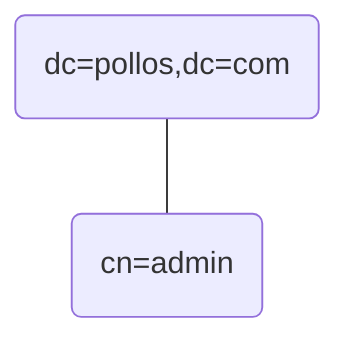
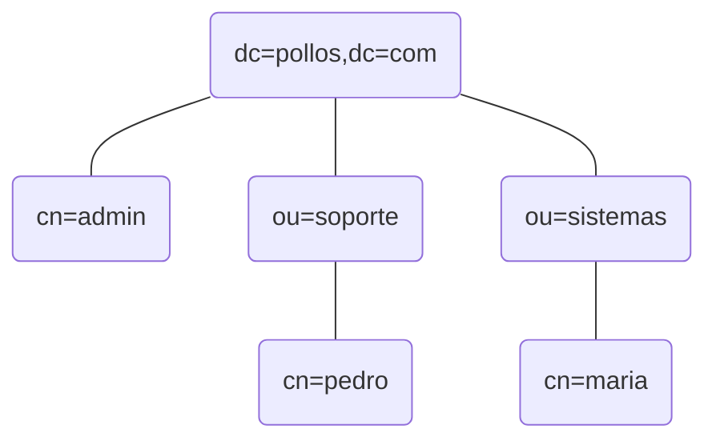

# Autenticación y autorización con LDAP

En general, el acceso a la funcionalidad de una aplicación se proporciona de manera restringida a los usuarios. Ciertos usuarios podrán ejecutar ciertas acciones pero no otras. Para saber qué puede o no hacer un usario hay que pasar por dos procesos: autenticación y autorización.

## Autenticación

Este es el proceso de validar que un usario es quien dice ser, y no otro. La forma típica de autenticar a un usuario es mediante nombre de usuario y clave (password). El nombre permite saber si dicho usuario existe, y la clave permite validar que quien está tratando de ingresar en efecto es dicha persona

> Cualquiera puede decir que es "pedro", pero solo el verdadero "pedro" conoce su clave (o al menos así debería ser si "pedro" tomó las medidas necesarias).

Si ambos valores, usuario y clave, coinciden o son correctos, el usuario puede ingresar, caso contrario se rechaza su acceso.

Esto no es más que el primer paso, ya que el usuario que ha sido autenticado, debe estar también autorizado a efectuar la acción que le interesa.

## Autorización

Este es el proceso de validar que un usuario que ya fue autenticado, y por ende tiene acceso al sistema, tiene el permiso necesario para ejecutar una cierta acción. Para esto, atado a cada usuario en el sistema, también se debe encontrar información adicional que le permita a la aplicación saber si el usuario, o más generalmente el "rol" de dicho usuario, le permite hacer lo que pretende.

> A manera de ejemplo sencillo, supongamos que "pedro" accede a una aplicación que potencialmente permite hacer CRUD sobre una tabla en una base de datos. Los administradores de la aplicación pueden haber decidido que todos los usuarios autenticados pueden efectuar un Retrieve, pero que solo los usuarios operadores, o con el rol de operador, pueden efectuar las otras acciones. Una vez "pedro" autenticado, el sistema debió también entregar información de su rol, como por ejemplo: *usr=pedro;rol=empleado*. Si "pedro" intenta hacer un Retrieve debe ser posible, puesto que está autenticado. Sin embargo, si intenta hacer un Create, la aplicación se lo impedirá, ya que no es operador, y por tanto no está autorizado. Si quien se autentica en cambio es "maria", y la información de su rol dice *usr=maria;rol=operador*, el sistema le debe permitir hacer todo, ya que tiene la autorización necesaria.

## Implementación

Incluir las funcionalidades de autenticación y autorización en una aplicación (web) es totalmente posible, y muchas aplicaciones lo hacen. El proceso sería, incluir una pantalla o página de "login" para que el usuario pueda autenticarse con sus credenciales. La aplicación busca en su base de datos si la información coincide o no. Si la autenticación es correcta, el usuario entra al sistema, caso contrario se le presenta nuevamente la página de login, o se presenta una página de error. Por cada acción que el usuario desee ejecutar en la aplicación, esta debe buscar en la base de datos el rol del usuario, y según ello decidir si este tiene el permiso adecuado para hacerlo.

Per-se, este proceso no es complejo. Se debe ser cuidadoso y minucioso a la hora de diseñar y programar esta funcionalidad y listo. Más aún, toda aplicación necesitará algún tipo de acciones dedicadas a ete proceso. Sin embargo, consideremos exclusivamente el caso de los ususarios y los roles en una organización donde además existen varias aplicaciones. Por cada aplicación sería necesario definir una base de datos que guarde la información para el proceso de validación. Esto implica primero que debe haber una coordinación precisa para definir una estructura común para la información, y segundo que debe haber una sincronización oportuna cuando la información cambia (nuevos usuarios, cambio de roles, ...).

Esta coordinación y sincronización entre aplicaciones, se ha visto hasta la saciedad que falla constantemente y que produce graves inconsistencias y fallos en la seguridad de una organización. La alternativa actualmente utilizada para solventar esta problemática implica que la información de usuarios y roles se guarda de manera centralizada, en un solo lugar, y que todas las aplicaciones se comuniquen con este repositorio, de una manera estándar, para todos los procesos de autenticación y autorización. 

## Protocolo ligero de acceso a directorios (LDAP)

El *Lightweight Directory Access Protocol*, [LDAP](https://es.wikipedia.org/wiki/Protocolo_ligero_de_acceso_a_directorios), es un estándar para acceder a la información guardada en un directorio jerárquico y estructurado. Esta información puede constar de usuarios, roles, departamentos y recursos en general, que describen a una organización y a sus componentes.

Estos directorios son similares a una base de datos configurada para realizar búsquedas muy rápidamente y proporcionar sobre todo un acceso de lectura muy eficiente. Los detalles específicos dependerán en cierto sentido de la implementación específica del protocolo, y los proveedores más usados son [OpenLDAP](https://www.openldap.org/) y [Active Directory](https://docs.microsoft.com/en-us/windows-server/identity/ad-ds/get-started/virtual-dc/active-directory-domain-services-overview).

### OpenLDAP

En esta parte vamos a instalar y configurar un servidor LDAP en un equipo Ubuntu.

> Esta es una referencia general bastante buena: https://www.digitalocean.com/community/tutorials/how-to-install-and-configure-openldap-and-phpldapadmin-on-ubuntu-16-04

> Puede hacerse en cualquier equipo Linux, desktop o server, físico o virtual, pero estas instrucciones utilizan el estilo Debian y están centradas en Ubuntu.

- Como siempre, primero asegúrese que su sistema está actualizado

    ```
    sudo apt update
    ```

- Instale OpenLDAP

    ```
    sudo apt-get install slapd ldap-utils
    ```

    > Seguramente el instalador le habrá pedido ingresar el password para el usuario "admin". En el siguiente paso podrá modificarlo si desea.

Una vez terminada la instalación, es necesario efectuar una configuración inicial antes de ingresar cualquier información en el directorio, esto sobretodo se debe a que el nombre de dominio que se está utilizando para su directorio es "example.com" y en general se prefiere usar el nombre de dominio oficial de su organización. Este nombre de dominio es importante por que hace las veces de raíz del árbol de información, y estará integrado a todos los objetos que cree.

> Si no tiene nombre de dominio oficial (o si solo está haciendo pruebas) no hay realmente problema, puede usar el dominio que usted desee, o dejar example.com (si deja example.com ni siquiera necesitaría hacer una nueva configuración).

- Configure OpenLDAP

    ```
    sudo dpkg-reconfigure slapd
    ```

Al hacer esto deberá responder un par de preguntas:
> Las respuestas específicas Yes/No podrían cambiar de acuerdo a sus necesidades, pero si las cambia averigue bien lo que va a hacer!

- Omit OpenLDAP server configuration? \<No>
- DNS domain name: (por ejemplo "pollos.com")
- Organization name: (por ejemplo "Pollos Refritos")
- Administrator password: (por ejemplo "12345678")
- Confirm password: (debe ser igual al anterior)
- Do you want the database to be removed when slapd is purged? \<No>
- Move old database? \<Yes>

Ahora vamos a inhabilitar el acceso anónimo a ldap

> este paso no es imprescindible, pero es muy recomendable sobretodo si su servidor es de acceso público

- Cree un archivo con extensión *.ldif* e ingrese el siguiente contenido (puede usar [ldap_disallow_anonymous.ldif](ldap_disallow_anonymous.ldif)):

```
dn: cn=config
changetype: modify
add: olcDisallows
olcDisallows: bind_anon

dn: cn=config
changetype: modify
add: olcRequires
olcRequires: authc

dn: olcDatabase={-1}frontend,cn=config
changetype: modify
add: olcRequires
olcRequires: authc
```

- Ejecute esta instrucción:

> Se asume que guardó el archivo en */home/yo/*. Si no es así modifique el path acorde

```
sudo ldapadd -Y EXTERNAL -H ldapi:/// -f /home/yo/ldap_disallow_anonymous.ldif
```

Ahora vamos a habilitar las conexiones seguras por SSL/TLS

- El acceso seguro, ldaps://, se efectua por el puerto 636, que debe abrirse en el firewall.
- Por defecto OpenLDAP no escucha en este puerto, de manera que debe abrir el archivo */etc/default/slapd*, y modificar la línea donde se encuentra la variable SLAPD_SERVICES:

    ```
    SLAPD_SERVICES="ldap:/// ldapi:///"
    ```

    Para añadir "ldaps:///", de manera que quede así:

    ```
    SLAPD_SERVICES="ldap:/// ldaps:/// ldapi:///"
    ```

- Para permitir conexiones seguras es necesario que su servidor LDAP cuente con un certificado. Si su equipo ya ofrecía conexiones seguras, por ejemplo por HTTPS, entonces ya tiene un certificado y solo debe configurar su servidor para reutilizarlo. Si no, hay varias alternativas:
    - Si ya tiene un nombre de dominio propio, puede conseguir un certificado oficial gratuito con [Let's Encrypt](https://letsencrypt.org/)
        - Si no tiene un nombre de dominio propio, pero tiene una IP fija, puede conseguir un dominio gratuitamente en [FreeNom](https://www.freenom.com/)
    - Si su IP es variable, como sucede en una red personal o en su casa, puede conseguir un dominio con [No-Ip](https://www.noip.com/), quienes también le ofrecen un certificado gratuito.
    - Puede generar un certificado "self-signed". Esta opción da problemas con clientes que se conectan desde el internet, ya que estos certificados no se pueden validar, al no ser generados por una autoridad reconocida. Para redes locales, sin embargo, funciona bien. [Aquí tiene una guía](https://github.com/daoc/TLS-certificates).
    - Obviamente tiene muchas alternativas pagadas!

- Una vez con su certificado, debe asegurarse que cuenta con los tres archivos requeridos:
    - El certificado del servidor (supongamos que está en el archivo */home/yo/certs/cert.pem*).
    - La clave privada de dicho certificado (supongamos que está en el archivo */home/yo/certs/privkey.pem*).
    - La cadena completa de certificados de la CA (Certificate Authority) que emitió el certificado (supongamos que está en el archivo */home/yo/certs/fullchain.pem*).

- Es necesario verificar que el usuario **openldap** pueda leer la clave privada. Para esto puede seguir estos pasos:
    - Añada openldap al grupo **ssl-cert**
        ```
        sudo usermod -a -G ssl-cert openldap
        ```
    - Cambie los permisos al archivo
        ```
        sudo chown :ssl-cert /home/yo/certs/privkey.pem
        sudo chmod 640 /home/yo/certs/privkey.pem
        ```

- Cree un archivo con extensión *.ldif* e ingrese el siguiente contenido (puede usar [ldap_enable_tls.ldif](ldap_enable_tls.ldif)):

```
dn: cn=config
changetype: modify
add: olcTLSCACertificateFile
olcTLSCACertificateFile: /home/yo/certs/fullchain.pem
-
add: olcTLSCertificateKeyFile
olcTLSCertificateKeyFile: /home/yo/certs/privkey.pem
-
add: olcTLSCertificateFile
olcTLSCertificateFile: /home/yo/certs/cert.pem
```

- Ejecute esta instrucción:

> Se asume que guardó el archivo en */home/yo/*. Si no es así modifique el path acorde

```
sudo ldapmodify -H ldapi:// -Y EXTERNAL -f /home/yo/ldap_enable_tls.ldif
```

- Reinicie el servicio

    ```
    sudo service slapd restart
    ```

- Cruce los dedos y pruebe alguna consulta simple desde el terminal

    ```
    ldapwhoami -W -D cn=admin,dc=pollos,dc=com -H ldaps://pollos.com
    ```

    >- ldapwhoami simplemente verifica los datos del usuario que se conecta
    >- -H indica el host al cual conectarse
    >- -D indica el dn (distinguished name) del usuario con el que se va a conectar
    >- -W pide el password del usuario

    El sistema le pedirá su password y si todo va bien responderá:

    ```
    Enter LDAP Password:
    dn:cn=admin,dc=pollos,dc=com
    ```

### phpLDAPadmin

Hay algunas utilidades que se puede usar para revisar o modificar la información que se encuentra en el directorio. Una de las más utilizadas es phpLDAPadmin (que lastimosamente no está tan actualizada).

Puede instalar esta utilidad directamente en su servidor Apache mediante:

```
sudo apt install phpldapadmin
```

El sitio web de la utilidad es este: http://phpldapadmin.sourceforge.net/

> Sin embargo, no funciona bien con php8.1

Otra forma que evita problemas de compatibilidad entre programas, es mediante Docker. 

La imagen se encuentra aquí: https://hub.docker.com/r/osixia/phpldapadmin/

Las instrucciones para su uso están aquí: https://github.com/osixia/docker-phpLDAPadmin

### Organización de la información en LDAP

LDAP guarda la información en un árbol jerárquico llamado DIT (Data Information Tree), compuesto de entradas.

Las entradas del árbol representan las entidades de las cuales nos interesa guardar información. Estas entradas pueden ser personas, departamentos, equipos o cualquier tipo de recurso en general.

Una entrada está compuesta de uno o más atributos, que guardan la información de la entidad en pares clave=valor.

Los atributos en una entrada no son arbitrarios y dependen de las clases asignadas a la entrada. Estas clases definen los atributos obligatorios y opcionales que compondrán la entidad. Las clases de una entidad se definen como otro atributo, y debe haber una (y solo una) clase estructural y cero o más clases auxiliares. Las clases también tienen una jerarquía, y una clase puede heredar de otra, adoptando sus atributos.

Cada entrada debe proporcionar un grupo de atributos que la identifiquen de forma única, esto se conoce como el distinguished name (DN). El DN consta de uno o más atributos propios de la entidad, más el DN de todas sus entradas antecesoras hasta la raíz.

La raíz del DIT es la organización, definida por los componentes de su nombre de dominio. Al configurar el sistema se nos pidió esta información, que en el ejemplo fue *pollos.com*. Este nombre de dominio se separa en sus componentes, generando el DN: `dn: dc=pollos,dc=com`.

>- `dn` es la clave del atributo distinguished name, y todo lo que va luego de los dos puntos es su valor. En este caso, el valor está constituido de dos atributos `dc`.
>- `dc` significa domain component. Cuando hay más de un atributo componiendo un valor, se los separa por comas.

La información completa de esta entrada, según el ejemplo dado al configurar el sistema sería:

```ldap
dn: dc=pollos,dc=com
dc: pollos
objectclass: organization
o: Pollos Refritos
```

> Podemos ver un atributo por línea, donde:
>- primero va el DN completo, que es el identificador de la entrada `dn: dc=pollos,dc=com`
>- luego va el DN relativo (o específico) de esta entrada `dc: pollos`
>- a continuación vemos la clase estructural que define el tipo de la entrada `objectclass: organization`
>- finalmente tenemos el atributo `o` (organizationName): `o: Pollos Refritos`, que está definido en la clase `organization`

Tomemos como otro ejemplo la información de la entrada correspondiente al usuario `admin`, que también definimos al configurar el sistema. Esta entrada es hijo directo de la organización:

```ldap
dn: cn=admin,dc=pollos,dc=com
cn: admin
description: LDAP administrator
objectclass: simpleSecurityObject
objectclass: organizationalRole
userpassword: {SSHA}xyzxyzxyzxyz
```

>- El DN se define con el DN relativo de esta entrada, añadido al DN de los ancestros. En este caso el único ancestro es la organización
>- `cn` (commonName) es el atributo que define el nombre del usuario. Se usa ese atributo debido a la clase `organizationRole`, donde es obligatorio.
>   - `admin` no es más que una parte del identificador de la entrada. Para usarlo, por ejemplo para conectarse a LDAP y hacer consultas, hay que usar el DN completo: `cn=admin,dc=pollos,dc=com`
>- `description` es un atributo opcional de `organizationRole`
>- `objectclass: simpleSecurityObject` se añade como clase auxiliar para poder contar con el atributo `userpassword`
>- `objectclass: organizationalRole` es la clase estructural
>- `userpassword` guarda el hash del password: `{SSHA}xyzxyzxyzxyz`

#### Añadir información al directorio

Como se dijo anteriormente, en un directorio LDAP se puede guardar una gran variedad de información. Sin embargo, dado que el tema que más compete, y probablemente para lo que más se usa LDAP, es para autenticación y autorización, se va a ejemplificar el ingreso de información de cuentas de usuario (cabe aclarar que de la misma manera se ingresa cualquier tipo de dato).

Al momento el ejemplo contiene solo dos entradas:



> Por facilidad los DN se presentarán sólo con el componente relativo. Recuerde que un DN completo se concatena con los DN relativos de todos los antecesores.

En primer lugar se va a incluir dos departamentos o unidades de la organización: soporte y sistemas. Dentro de estos se va a incluir un par de usuarios: pedro en soporte y maria en sistemas:



Para las unidades vamos a utilizar la siguiente definición:

```ldap
dn: ou=soporte,dc=pollos,dc=com
ou: soporte
objectClass: organizationalUnit

dn: ou=sistemas,dc=pollos,dc=com
ou: sistemas
objectClass: organizationalUnit
```

> La clase estructural es `organizationalUnit`, la cual define el atributo obligatorio `ou` (organizationalUnitName). `ou` será el DN relativo de estas dos entradas.
>- fíjese en que es necesario definir el DN completo de cada entrada!

Para ingresar la información al directorio se puede utilizar la opción *import* en phpLDAPadmin, y simplemente pegar el texto en el campo que se presenta (o, claro, usar directamente las funciones de la interfaz, para lo cual se le desea mucha suerte).

La forma que se va a ver aquí es usando el comando *ldapadd* desde el terminal. Para ello grabe la definición en un archivo ldif (supongamos /home/yo/units.ldif) y ejecute el comando:

```sh
ldapadd -H ldapi:// -D cn=admin,dc=pollos,dc=com -W -f /home/yo/units.ldif
```

>- `-H ldapi://` solo se puede usar si estamos dentro del mismo servidor. Si estamos desde otro equipo abrá que usar `-H ldaps://pollos.com`
>- `-D cn=admin,dc=pollos,dc=com` es el DN del usuario admin y `-W` indica que se deberá ingresar el password de manera interactiva (lo mejor para que no se vea en el terminal)
>- `-f /home/yo/units.ldif` indica el archivo donde está la definición que se va a añadir

Ahora, para los usuarios se va a usar esta definición:

```ldap
dn: cn=pedro,ou=soporte,dc=pollos,dc=com
cn: pedro
objectclass: simpleSecurityObject
objectclass: organizationalRole
userpassword: {SSHA}ytiQAVoiRnaJjYgJVL3pnpvSr3XCy1az

dn: cn=maria,ou=sistemas,dc=pollos,dc=com
cn: maria
objectclass: simpleSecurityObject
objectclass: organizationalRole
userpassword: {SSHA}vpCa6IOZAy7erj9LhU/48lRfZ8OlejBc
```

> Los passwords en el ejemplo son "pedro" y "maria" respectivamente (igual que el nombre de usuario). Si bien se podrían guardar en claro, siempre se debe guardar un hash por seguridad. En este caso se está generando el hash con SSHA (SHA con semilla)
>- Usted puede generar los hash desde el terminal con slappasswd, como se muestra a continuación. `-h` define el tipo de hash a generar, y `-s` indica el password en claro.
>   - `slappasswd -h {SSHA} -s pedro`
>       > si usted ejecuta este comando verá que el hash es diferente al que se puso en la definición, por que la semilla cambia en cada ejecución de slappasswd (más seguridad!).

Para ingresar esta definición al sistema se hace igual que en el ejemplo anterior de las unidades. Si grabó la definición en /home/yo/users.ldif, ejecute el comando:

```sh
ldapadd -H ldapi:// -D cn=admin,dc=pollos,dc=com -W -f /home/yo/users.ldif
```

#### Buscar información en el directorio

Para buscar información dentro del directorio desde el terminal (puede usar también phpLDAPadmin, por supuesto), se usa el comando *ldapsearch*. A continuación algunos ejemplos.

Si desea recuperar todas las entradas en el directorio puede utilizar:

```sh
ldapsearch -H ldapi:// -D cn=admin,dc=pollos,dc=com -W -b dc=pollos,dc=com -s sub "(objectclass=*)"
```

>- los operadores `-H -D y -W` son igual que con *ldapadd*
>- `-b` indica la base, o a partir de dónde se quiere iniciar la búsqueda. Aquí se está indicando la raíz del árbol, pero puede iniciar desde cualquier entrada, indicando su DN
>- `-s` proporciona el parámetro de búsqueda. En primer lugar puede especificar `sub`, `one` o `base`. sub indica que se buscará en todo el sub árbol, one indica que solo se buscará hasta un nivel bajo la base y base que sólo se buscará la base misma. Luego se indica entre comillas los atributos que se va a filtrar. Cada atributo va entre paréntesis. En este ejemplo se indica que se busca las entradas con un atributo `objectclass` de cualquier valor (`*`). Como todas las entradas deben tener al menos una clase, esta búsqueda devuelve todas las entradas.
>   - Este ejemplo podría simplificar aún más la opción -s, poniendo solamente `-s sub` (sin filtro)

Como se ve, la combinación de `-b` y `-s` nos permite encontrar entradas específicas. Si por ejemplo desea encontrar todos los usuarios dentro de la unidad "soporte", puede usar:

```sh
ldapsearch -H ldapi:// -D cn=admin,dc=pollos,dc=com -W -b ou=soporte,dc=pollos,dc=com -s sub "(cn=*)"
```

Puede ver muchas más alternativas [aquí](https://docs.ldap.com/ldap-sdk/docs/tool-usages/ldapsearch.html)

#### Autenticación y autorización

Autenticar un usuario y autorizarlo a efectuar alguna acciónm, está en manos de la aplicación. El directorio simplemente nos da la información que le pedimos. No dice si el usuario existe y el password es correcto, y nos proporciona la información de unidad o rol que se pide. La aplicación usa esa infromación para tomar sus decisiones.

Dicho esto, cada aplicación deberá implementar este proceso de manera particular, dependiendo sobre todo de cómo sus librerías le permiten interactuar con LDAP para solicitar información. Si quisiéramos autenticar un usuario desde el terminal, por ejemplo, podemos usar *ldapwhoami*:

```sh
ldapwhoami -D cn=pedro,ou=soporte,dc=pollos,dc=com -w pedro
```

> Si el DN del usuario existe y es correcto, y el password puesto con la opción `-w` también es correcto, entonces veremos como resultado devuelto el DN del usuario:
    ```
    dn:cn=pedro,ou=soporte,dc=pollos,dc=com
    ```
Caso contrario veremos un mensaje de error:
    ```
    ldap_bind: Invalid credentials (49)
    ```

> Nótese también la diferencia entre `-W` y `-w`: en mayúscula pide el password interactivamente (no se verá en el terminal), en minúscula se debe incluir en el comando

Ahora tomemos como ejemplo una aplicación web que se está ejecutando sobre un servidor Apache. Si dicha aplicación fue diseñada sin ningún tipo de seguridad, podemos incluirsela sin necesidad de modificarla, simplemente modificando la configuración de Apache.

Primero se debe activar el módulo ldap en apache con el comando `sudo a2enmod ldap authnz_ldap` y luego resetearlo con `sudo service apache2 restart`.

Supongamos que la aplicación que queremos asegurar está cargada en el directorio */var/www/html/miapp*:

- primero debemos ubicar el archivo de configuración de Apache, que suele estar en el directorio */etc/apache2/sites-enabled/*. El nombre del archivo puede ser *000-default.conf*
- dentro del archivo se debe buscar el elemento *VirtualHost*, que podría ser algo así `<VirtualHost _default_:443>`, indicando que configura el acceso por https (puerto 443).
    - como se están transfiriendo contraseñas, el acceso DEBE ser por https
- Al final de *VirtualHost* se debe añadir la configuración dentro de un elemento *Directory*, como por ejemplo:

```apache
<Directory /var/www/html/miapp>
    AuthName "LDAP Authentication"
    AuthType Basic
    AuthBasicProvider ldap
    AuthLDAPBindDN cn=admin,dc=pollos,dc=com
    AuthLDAPBindPassword pwd_admin
    AuthLDAPURL "ldaps://pollos.com/dc=pollos,dc=com?cn"
    Require valid-user
</Directory>
```

>- En el encabezado del elemento `Directory` se añade el directorio de la aplicación que se va a configurar
>- `AuthName` define el ámbito de la aplicación. El servidor le pedirá al cliente una sola vez las credenciales por cada ámbito
>- `AuthType Basic` indica el modo de envío de credenciales hacia el servidor. El modo `Basic` las envía en claro, por lo que es imprescindible que la conexión se realice por https
>-  `AuthBasicProvider ldap` indica que se usará LDAP
>- `AuthLDAPBindDN` indica el DN del usuario que se conectará a ldap para validar las credenciales del cliente
>- `AuthLDAPBindPassword` indica el password del usuario definido en AuthLDAPBindDN
>   - AuthLDAPBindDN y AuthLDAPBindPassword no son necesarios si se dejó activa la posibilidad de conexión anónima en LDAP
>- `AuthLDAPURL` es el parámetro de búsqueda en formato de URL: `ldaps://pollos.com/dc=pollos,dc=com?cn`. Aquí se usa el protocolo `ldaps`, el servidor es `pollos.com`, la base es `dc=pollos,dc=com`, los parámetros se separan con `?` y se indica que el atributo donde se buscará el nombre del usuario es `cn`
>- `Require valid-user` indica que cualquier usuario que logre autenticarse, estará autorizado a ingresar a la aplicación

- Luego de guardar el archivo con la configuración hay que actualizarla en apache, lo que se puede hacer con el comando `sudo service apache2 reload`

Si por ejemplo quisiéramos que solo los usuarios en la unidad soporte pudieran usar esta aplicación, podríamos modificar la base en el `AuthLDAPURL`:

```apache
AuthLDAPURL "ldaps://pollos.com/ou=soporte,dc=pollos,dc=com?cn"
```

> si prueba esto, maría ya no podrá conectarse, solo pedro

Si ahora quisiéramos que solo los usuarios ana y juan (habría que ingresarlos) pudieran acceder, podríamos modificar el `Require`:

```apache
Require ldap-user ana juan
```

Puede ver más alternativas [aquí](https://httpd.apache.org/docs/2.4/mod/mod_authnz_ldap.html)

Si se prefiere contactar a LDAP desde la misma aplicación también se puede hacer, pero el mecanismo variará dependiendo del lenguaje de programación que utilice. En [ldap.php](ldap.php) se presenta un ejemplo de cómo hacerlo con PHP. Analícelo!
